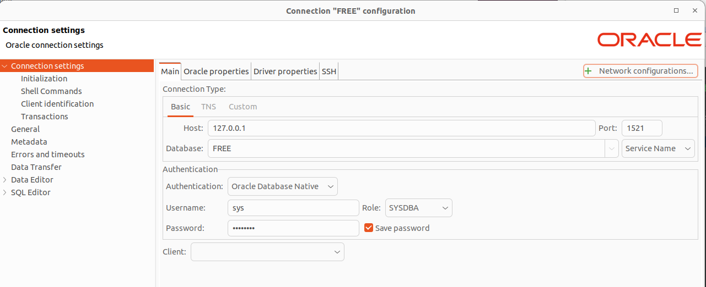

# Oracle




## Oracle dependencies
* sudo apt install -y libaio1
* Download and unzip https://download.oracle.com/otn_software/linux/instantclient/2113000/instantclient-basic-linux.x64-21.13.0.0.0dbru.zip

* sudo mkdir /opt/oracle
* from unzipped folder move instantclient_21_13 to /opt/oracle 
* add to .bashrc
```
export LD_LIBRARY_PATH=/opt/oracle/instantclient_21_13:$LD_LIBRARY_PATH
export PATH=/opt/oracle/instantclient_21_13:$PATH

```

## In SQL console
```sql
CREATE USER <your user> IDENTIFIED BY <your password>;
GRANT ALL PRIVILEGES TO <your user>;

```

## SQLAlchemy URL
```python
db_name = 'FREEPDB1'
db_user = '<your user>'
db_pass = '<your password>'
db_host = '127.0.0.1'
db_port = 1521
driver = 'oracle+cx_oracle'
URL = f'{driver}://{db_user}:{db_pass}@{db_host}:{db_port}/?service_name={db_name}'
```
